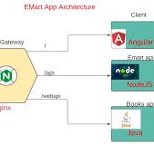

# emart-app

## Outcomes:
- Getting familiar with Microservices and Docker Compose.
- Understanding Microservices concepts.
- Using Docker to containerize applications.
- Utilizing Vagrant for provisioning at the beginning before starting the VM.